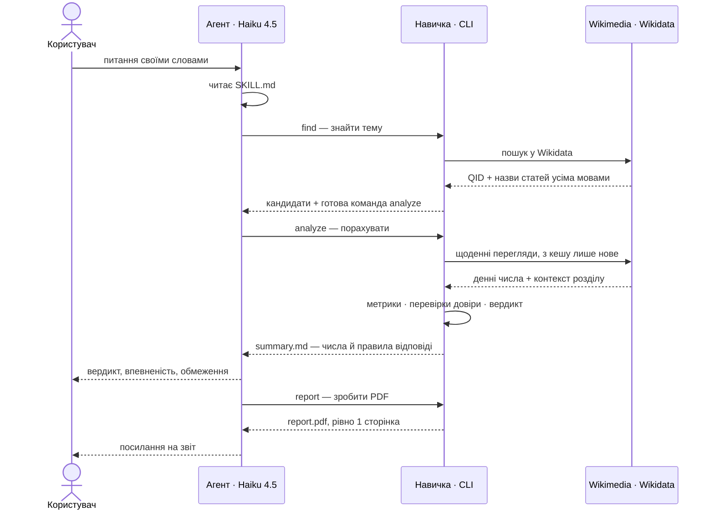
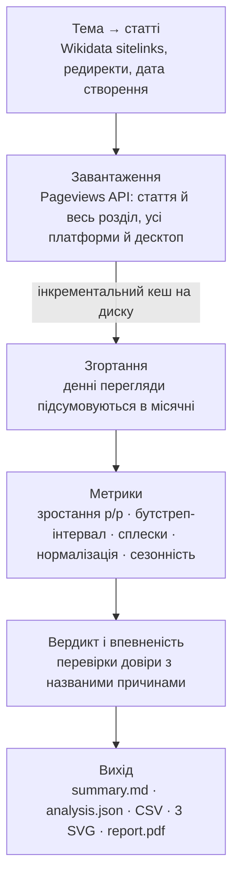
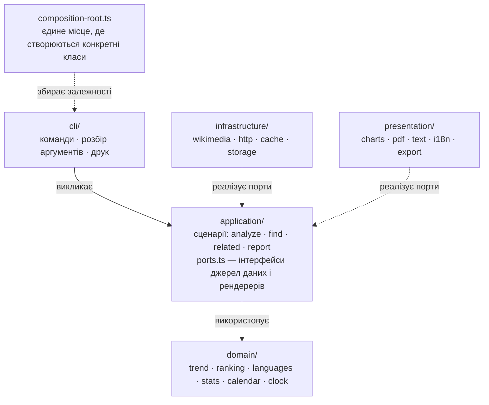
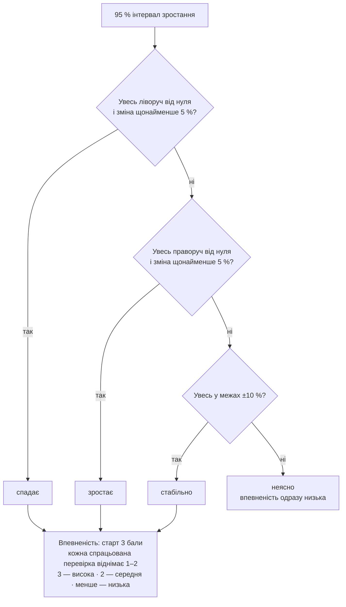

# wiki-interest-research: навичка AI-агента для дослідження інтересу до тем за переглядами Вікіпедії

Навичка у форматі [Agent Skills](https://agentskills.io) допомагає засновникам B2C-продуктів вирішувати,
**які теми розвивати і якими мовами запускатися**. Агент знаходить потрібні статті в різних мовних
розділах Вікіпедії, завантажує статистику переглядів Wikimedia, оцінює, чи зростає інтерес і
**наскільки цьому можна довіряти**, будує графіки та PDF-звіт на одну сторінку.

Ключовий принцип: **усі числа рахує код, агент лише обирає статті, запускає команди й пояснює
результат.** Тому навичкою впевнено користується навіть швидка недорога модель (перевірено на Claude Haiku 4.5).

```
Користувач: «Чи зростає інтерес до астрономії в україномовній Вікіпедії і наскільки цьому можна довіряти?»
Агент:  find → related → analyze → report
Відповідь: «Ні, падає: −51% р/р за 6 ключовими статтями (95% інтервал −56%…−43%), спад в усіх 12 місяцях;
            уся укрВікі втратила 25%, але й відносно неї тема −34%. Впевненість висока.» + report.pdf
```

## Зміст

1. [Що вміє навичка](#1-що-вміє-навичка)
2. [Швидкий старт](#2-швидкий-старт)
3. [Як це працює](#3-як-це-працює)
4. [Як навичка допомагає агенту оцінювати й перевіряти висновки](#4-як-навичка-допомагає-агенту-оцінювати-й-перевіряти-висновки)
5. [Повторні та пов'язані запити](#5-повторні-та-повязані-запити)
6. [Чому навичка підходить для дешевої моделі](#6-чому-навичка-підходить-для-дешевої-моделі)
7. [Результати на прикладах із завдання](#7-результати-на-прикладах-із-завдання)
8. [Тестування і перевірка](#8-тестування-і-перевірка)
9. [Як використовувався AI і як перевірявся результат](#9-як-використовувався-ai-і-як-перевірявся-результат)
10. [Припущення та обмеження](#10-припущення-та-обмеження)
11. [Як розвивати навичку далі](#11-як-розвивати-навичку-далі)
12. [Структура репозиторію](#12-структура-репозиторію)

## 1. Що вміє навичка

- **Знаходить статті будь-якою мовою через Wikidata**: одне поняття (наприклад, Q1666254 «інтервальне
  голодування») → назви статей у кожному мовному розділі. Якщо статті немає, прямо про це повідомляє
  (це теж інсайт: прогалина в контенті), а не підміняє мовчки схожою.
- **Будує «кошик» статей для широких тем** (астрономія = астрономія + Сонячна система + чорна діра + …),
  пропонуючи схожі статті з їхньою популярністю.
- **Завантажує щоденні перегляди людьми** (без ботів) для статей і для всього мовного розділу.
- **Рахує зростання рік до року з 95% довірчим інтервалом** і перевіряє його надійність: сплески,
  ознаки ботів, падіння трафіку всієї Вікіпедії, малий обсяг, нові чи перейменовані статті, сезонність.
- **Ставить вердикт і рівень впевненості** за прозорими правилами з поясненням причин.
- **Порівнює й ранжує мови/теми** за формулою з вагами, які користувач може змінити під свої критерії.
- **Графіки** (SVG) і **PDF на одну сторінку** українською чи англійською, з висновком агента,
  таблицею, перевірками довіри, обмеженнями та посиланнями для незалежної перевірки чисел.
- **Кеш**: повторні й уточнені запити виконуються за частки секунди.

## 2. Швидкий старт

Потрібен Node.js ≥ 20.10.

```bash
git clone <URL цього репозиторію> wiki-interest-research
cd wiki-interest-research
npm ci                                     # точні версії з package-lock.json
node scripts/wiki.mjs doctor               # перевірка залежностей, мережі та кешу

node scripts/wiki.mjs find "intermittent fasting" --langs pl,cs
node scripts/wiki.mjs related Q333 --langs uk
node scripts/wiki.mjs analyze --topic "Астрономія=Q333,Q544,Q589,Q318,Q4213,Q37547" --langs uk --ui-lang uk
node scripts/wiki.mjs report --run "wiki-interest-output/астрономія_uk_24m" --lang uk \
     --question "Чи зростає інтерес до астрономії?" --answer "..." --rec "..."
```

**Встановлення для агента.** Скопіюйте (або клонуйте) папку в каталог навичок агента, наприклад
`~/.claude/skills/wiki-interest-research` для Claude Code, і виконайте в ній `npm ci`. Агент бачить
лише назву й опис навички, а SKILL.md читає, коли запит підходить.

**User-Agent.** З 2026 року Wikimedia дає клієнтам без контактних даних у User-Agent лише ~10 запитів
на хвилину (з контактами — 200). Вкажіть URL репозиторію чи email: `WIKI_SKILL_CONTACT=https://github.com/...`
(або змініть `DEFAULT_CONTACT` у `src/settings.ts`).

## 3. Як це працює

Агент читає `SKILL.md` лише коли запит підходить, а далі виконує послідовність команд, де кожна
друкує наступну. Числа рахує код — модель обирає статті й переказує результат.



Що відбувається з даними всередині `analyze`:



### Ключові рішення і чому саме так

| Рішення                                                                     | Чому                                                                                                                                                        |
| --------------------------------------------------------------------------- | ----------------------------------------------------------------------------------------------------------------------------------------------------------- |
| Числа рахує детермінований код, агент тільки інтерпретує                    | Дешеві моделі помиляються в арифметиці й вигадують числа. Код прибирає цей клас помилок; SKILL.md забороняє перераховувати.                                 |
| Зіставлення мов через Wikidata, а не переклад назв                          | Назви статей не перекладаються дослівно («Інтервальне голодування» ≠ «Post przerywany»); Wikidata дає точну відповідність і чесно показує, де статті немає. |
| Порівняння «ті самі місяці рік тому»                                        | Сезонність (навчальний рік, січневі «нові звички») взаємно гаситься без складних моделей.                                                                   |
| 95% інтервал — парний бутстреп по місяцях                                   | Пояснюється одним реченням і не потребує припущень про розподіл. Широкий, якщо зростання дали 1–2 місяці; вузький, якщо воно стабільне.                     |
| Нормалізація на весь мовний розділ                                          | Трафік Вікіпедії змінюється сам по собі: у реальних даних укрВікі −25% р/р, іспанська −21%. Без цього будь-яка тема виглядала б «спадною».                  |
| Детектор сплесків: > 3× від 29-денної медіани з поправкою на шум            | Відділяє разові новинні хвилі від тренду; «без сплесків» показує, скільки зростання лишається.                                                              |
| Прозорі правила впевненості (бали) замість «чорної скриньки»                | Кожне зниження впевненості має названу причину, яку агент переказує користувачу.                                                                            |
| Ранжування за песимістичним краєм інтервалу                                 | Ненадійне зростання не може «виграти» випадково; ваги задає користувач.                                                                                     |
| SVG-графіки власноруч + PDFKit                                              | Жодних нативних залежностей (canvas, headless-браузер) — однаково працює на Windows/macOS/Linux.                                                            |
| TypeScript через tsx, `package-lock.json`                                   | Відтворюване середовище одним `npm ci`, без скомпільованих файлів у репозиторії.                                                                            |
| Бібліотека там, де вона несе складність (pdfkit, svg-to-pdfkit, bottleneck) | Планування запитів, генерація PDF і розбір SVG віддані перевіреним пакетам; своїм лишилося те, що є змістом завдання або не має відповідника.               |

Детальні формули, пороги та обґрунтування: [references/methodology.md](references/methodology.md).

### Архітектура коду

Код поділено на чотири шари. Правило одне: **залежності йдуть тільки всередину, до `domain`**.
Домен не знає ні про мережу, ні про файли, ні про PDF.



| Принцип                   | Де видно в коді                                                                                                                                                                                  |
| ------------------------- | ------------------------------------------------------------------------------------------------------------------------------------------------------------------------------------------------ |
| Одна відповідальність     | `domain/trend/` — окремі модулі для вікон порівняння, зростання, сплесків, сезонності, вердикту; PDF розкладено на полотно, зміст, блоки й алгоритм розміщення                                   |
| Відкритість до розширення | Нова перевірка довіри — це клас, що реалізує `TrustCheck`, і рядок у списку `DEFAULT_TRUST_CHECKS`; нова команда — клас `Command` у реєстрі; нова перевірка в evals — функція в реєстрі `CHECKS` |
| Інверсія залежностей      | Сценарії залежать від інтерфейсів `EntityCatalog`, `ArticleDirectory`, `PageviewSource`, `AnalysisStore`, `ReportRenderer`, а не від Wikimedia чи PDFKit                                         |
| Ізоляція від середовища   | `process.env` читається лише в `settings.ts`, поточна дата — через інтерфейс `Clock`, увесь друк — через `Output`                                                                                |
| Тестованість як наслідок  | `tests/analyze-topics.test.ts` проганяє повний сценарій аналізу на підроблених джерелах: без мережі, кешу й файлів                                                                               |

Вся робота з PDFKit зібрана в одному класі `PdfCanvas`, з `fetch` — у `FetchTransport`, з файловим кешем —
у `FileCache`. Замінити джерело даних, формат звіту чи сховище можна, не чіпаючи ні доменну логіку, ні сценарії.

## 4. Як навичка допомагає агенту оцінювати й перевіряти висновки

1. **Вердикт з правилами.** `rising`/`falling` лише коли 95% інтервал не містить нуля і зміна ≥ 5%;
   `stable`, якщо інтервал у межах ±10%; інакше `unclear` — «даних недостатньо для висновку».
2. **Впевненість з причинами.** Стартує з «високої» і знижується за конкретні проблеми: малий обсяг,
   зростання зі сплесків, суперечливі місяці, трафік, схожий на ботів, нова/перейменована стаття, тренд,
   що лише повторює всю Вікіпедію. Причини друкуються в розділі _Checks_ і потрапляють у PDF.



3. **«Key findings (safe to quote)»** — готові речення з числами, які агент може цитувати без перерахунку.
4. **Незалежна перевірка.** Для кожної мови друкується посилання на pageviews.wmcloud.org з тими ж
   статтями й періодом, щоб людина могла звірити сирі числа.
5. **Правила висновків у SKILL.md**: цитувати числа дослівно, не вигадувати причин сплесків, завжди
   називати обмеження (цікавість ≠ готовність платити; мова ≠ країна) і пропонувати крок валідації.
6. **Пастки в даних, які навичка ловить** (усі знайдені під час розробки на реальних даних):
   - у польській Вікіпедії **немає статті** про інтервальне голодування → «виміряти неможливо», а не «нуль інтересу»;
   - Wikimedia **приховує країни** зі свого списку захисту: у турецькій Вікіпедії «немає» Туреччини,
     у в'єтнамській — В'єтнаму. Наївний висновок «47% читачів в'єтнамської Вікіпедії — зі США» був би хибним;
     навичка позначає такі дані як `INCOMPLETE`;
   - **падіння всієї платформи** (укрВікі −25% р/р) → колонка «відносно розділу»;
   - **шкільна сезонність** (провал у червні, пік у вересні) → порівняння тих самих місяців;
   - **редиректи**: у португальській Вікіпедії 19% переглядів IELTS ідуть через редирект «IELTS» на довгу назву статті;
   - **перейменування й нові статті**: різкий старт переглядів з нуля знижує впевненість.

## 5. Повторні та пов'язані запити

- **Інкрементальний кеш за логічним ключем** (мова + стаття + тип доступу), а не за URL: якщо спершу
  запитали 2 роки, а потім 3 — докачується лише бракуючий рік. Дні, старші за 3 доби, вважаються
  остаточними; метадані кешуються на 7 днів.
- Приклад (6 мов, 12 статей): перший запуск ≈ 26 с (≈ 75 запитів), повтор чи зміна ваг — **0,2 с, 0 запитів**.
- **Детермінований вихід**: папка результату залежить від теми, мов і періоду, тож уточнення
  («додай словацьку», «3 роки», «вага зростання вища») — це той самий `analyze` зі зміненими параметрами.
- **Дотримання лімітів Wikimedia 2026**: ≤ 3 паралельні запити, ≤ 150 запитів/хв, User-Agent з контактом,
  повтор з урахуванням `Retry-After` на 429/503.

## 6. Чому навичка підходить для дешевої моделі

- 4 основні команди з розумними значеннями за замовчуванням; кожна команда друкує **наступну команду**.
- Короткий «перетравлений» `summary.md` (≈ 40–80 рядків) замість сирих даних, з блоком «How to answer» наприкінці —
  нагадуванням правил саме в момент, коли модель формулює відповідь.
- Помилки з підказками, що робити: `"ua" looks like a country code… Did you mean "uk"?`.
- SKILL.md коротка (≈ 135 рядків), деталі — у `references/` (прогресивне розкриття: модель читає їх лише за потреби).
- PDF завжди рівно на одну сторінку: код сам масштабує текст і прибирає другорядні блоки.
- Перевірено на **Claude Haiku 4.5** в реальному Claude Code (див. розділ 8 і `evals/`).

## 7. Результати на прикладах із завдання

Реальні дані Wikimedia, період вер 2024 – серп 2026 (зростання = вер 2025–серп 2026 проти вер 2024–серп 2025).
PDF-звіти лежать у [`examples/`](examples/).

| Запит                                             | Що показала навичка                                                                                                                                                                                                                                                                     |
| ------------------------------------------------- | --------------------------------------------------------------------------------------------------------------------------------------------------------------------------------------------------------------------------------------------------------------------------------------- |
| Інтервальне голодування: польська vs чеська       | У **польській Вікіпедії статті немає** (Q1666254 не має plwiki) → порівняння неможливе без замінника. Чеська: −54% р/р [−69%…−33%], 0/12 місяців зростання, але лише ~5 переглядів на день → **низька впевненість**.                                                                    |
| Астрономія в україномовній Вікіпедії              | Кошик із 6 статей: **−51% р/р** [−56%…−43%], спад в усіх 12 місяцях; уся укрВікі −25%, відносно неї тема −34% → **падає, висока впевненість**. Сезонний пік — вересень–жовтень (навчальний рік).                                                                                        |
| Вивчення англійської (IELTS + TOEFL) у 6 розділах | Падіння в 5 із 6 розділів (від −34% у польській до −62% у португальській); **турецька — «неясно»** (−11%, інтервал містить нуль; відносно розділу +6%). Рейтинг: в'єтнамська і турецька — найбільший обсяг і найменше відносне падіння; для них позначено, що дані за країнами неповні. |

## 8. Тестування і перевірка

**Автотести** (`npm test`, 32 тести, вбудований `node:test`, ~3 секунди):

- **синтетичні дані з відомою правильною відповіддю** (`tests/trend-analysis.test.ts`, 10 сценаріїв):
  рівне +20% → `rising`/висока впевненість; чиста сезонність → `stable`, не «зростає»; «зростання»
  з кількох днів-сплесків → не надійне; падіння всієї платформи відокремлюється від теми; стрибок
  частки десктопу → підозра на ботів; 6 переглядів на день → завжди низька впевненість; різкий
  старт (нова або перейменована стаття) → прапорець; інтервали відтворювані від прогону до прогону;
- **наскрізний офлайн-прогін** на записаних реальних відповідях API (`tests/fixtures`): CLI → аналіз
  → PDF; перевіряє відомі числа й те, що звіт із дуже довгими текстами все одно займає рівно 1 сторінку;
- **сценарій аналізу на підроблених джерелах** (`tests/analyze-topics.test.ts`): мова без статті
  потрапляє в нотатки, а не підміняється мовчки — без мережі, кешу й файлів;
- **базова статистика** (`tests/stats.test.ts`): квантилі, ковзна медіана, знаковий тест проти
  біноміального розподілу, бутстреп схлопується в точку при рівному зростанні;
- **розбір аргументів і кодів мов** (`tests/input-parsing.test.ts`): `ua`→`uk` з підказкою, дедуплікація,
  неповні дані по країнах, «останній повний місяць» із запасом у 2 дні;
- **тест самого оцінювача** (`tests/eval-checks.test.ts`): перевірка «числа з інструмента» ловить
  вигаданий відсоток у відповіді моделі;
- `npm run typecheck` — строга перевірка типів TypeScript.

**Мутаційна перевірка тестів.** Тести можуть проходити й нічого не стерегти, тому код навмисно
ламався у п'яти місцях із перевіркою, чи падає саме потрібний тест:

| Що зламано                                                | Впало тестів | Який саме                                                |
| --------------------------------------------------------- | ------------ | -------------------------------------------------------- |
| детектор сплесків вимкнено (`SPIKE_MULTIPLE` 3 → 1000)    | 1            | «зростання з кількох сплеск-днів не визнається надійним» |
| перевірка сталості місяців вимкнена (⅔ → 0)               | 1            | «зростання меншістю місяців позначається як нерівне»     |
| детектор ботів вимкнено (`BOT_DESKTOP_SHIFT` 0,15 → 0,95) | 1            | «сплеск лише з десктопу позначається як можливий бот»    |
| нормалізація: ділення замінено відніманням                | 1            | «падіння платформи відокремлюється від інтересу до теми» |
| поріг суттєвої зміни 5% → 50%                             | 4            | усі тести про вердикти                                   |

Перші чотири — точні влучання: одна зламана річ, один упалий тест, і саме той, що за неї відповідає.

**Побайтова перевірка проти попередньої реалізації.** Код було переписано зі збереженням поведінки,
і це доведено, а не заявлено: той самий аналіз, прогнаний обома версіями, дав побайтово однакові
`chart_trend.svg`, `chart_growth.svg`, `chart_daily.svg`, `monthly.csv`, `daily.csv`, англійський
і український `report.pdf` (після нормалізації двох полів, які PDFKit пише щоразу різними —
часу створення й випадкового `/ID`), а в `analysis.json` збіглися 10 із 12 ключів; два інші —
номер версії й рядок запуску.

**Звірка з реальністю.** Живий прогін із порожнім кешем (9 запитів) дав ті самі числа, що й записані
фікстури. У кожному звіті й у `summary.md` є посилання на офіційний інструмент
[pageviews.wmcloud.org](https://pageviews.wmcloud.org/) з тими самими параметрами — будь-яке число
можна звірити вручну за десять секунд.

**Агентні тести на дешевій моделі** (`evals/`): 6 сценаріїв (3 приклади із завдання, помилкові коди
мов UA/CZ, уточнення з повторним запуском, «майже схожий» запит, на який навичка НЕ має спрацьовувати)
запускаються в справжньому Claude Code з моделлю Haiku 4.5 і оцінюються **програмно, а не іншою
моделлю**: чи агент використав навичку, чи не писав власний код, чи створив PDF, чи згадав
впевненість, і — найважливіше — **чи всі відсотки у відповіді справді є у виводі інструмента**
(детектор вигаданих чисел).

Інструкції навички доопрацьовувалися за транскриптами трьох ітерацій:

| Ітерація | Пройдено перевірок | Що змінилось після аналізу транскриптів                                                                                                     |
| -------- | ------------------ | ------------------------------------------------------------------------------------------------------------------------------------------- |
| 1        | 27/29              | вигадане «±15–20%», не названо впевненість, пізнє спрацювання навички → опис став наполегливішим, вимога цитувати лише числа з `summary.md` |
| 2        | 26/29              | збій середовища: модель почала міняти оболонки й шляхи → правило «повтори ту саму команду тим самим шляхом»                                 |
| 3        | **30/30**          | навичка вмикається з першого виклику; викликів на сценарій упало з 4–10 до 3–5                                                              |

Журнал прогонів — у [`evals/results.md`](evals/results.md).

```bash
node --import tsx evals/run-claude.ts --model claude-haiku-4-5-20251001      # Claude Code, Haiku 4.5
OPENROUTER_API_KEY=... node --import tsx evals/run-openrouter.ts --model <модель>:free   # інша модель через OpenRouter
```

## 9. Як використовувався AI і як перевірявся результат

Навичку розроблено за допомогою AI-асистента (Claude Code): обговорення архітектури, генерація коду,
тестів і документації. Результат AI не приймався «на віру» — ось як він перевірявся:

1. **Типи та тести**: строгий TypeScript; тести на синтетичних даних, де правильна відповідь відома
   заздалегідь; мутаційна перевірка, що тести справді ловлять помилки.
2. **Незалежний перерахунок**: ключові числа перераховано іншим шляхом (інший ендпоінт API, інша мова
   програмування) — збіг до одиниці.
3. **Ручний перегляд результатів**: кожен PDF і графік відкривався й переглядався. Так знайдено й
   виправлено: накладання підписів осі, неправильний масштаб SVG у PDF, переповнення звіту на 2 сторінки
   при 6 мовах, англійські підписи в українському звіті, граматику числівників.
4. **Перевірка на реальних даних** виявила пастки, яких не було в початковому плані: приховані країни,
   відсутні статті, падіння всієї платформи, rate limit Wikimedia 2026 → для кожної додано обробку і тест.
5. **Агентні тести на Haiku**: транскрипти показали реальні проблеми (пізнє спрацювання навички,
   вигадане число в відповіді) → правки в описі й інструкціях навички та повторний прогін.

## 10. Припущення та обмеження

- **Перегляди ≠ готовність платити.** Це сигнал, що варто перевірити, а не доказ попиту.
- **Мовний розділ ≠ країна.** Іспанську читають в Іспанії, Мексиці, Аргентині; частина носіїв читає
  англійську Вікіпедію. Дані за країнами приватно-захищені й неповні для деяких країн.
- **Фільтр ботів Wikimedia неідеальний**; навичка додатково шукає аномалії, але не гарантує чистоту.
- **Рахуються поточні назви статей**; редиректи й інші статті на тему не входять (частка редиректів показується).
- **Малі розділи й нішеві теми** дають кілька переглядів на день — висновки там слабкі (навичка це позначає).
- **Зміни платформи** (AI-відповіді в пошуку, перекласифікація ботів) нормалізація враховує лише частково.
- **Ліміти API**: одне дослідження — до 10 серій (теми × мови); для масштабних досліджень потрібні дампи (див. нижче).

## 11. Як розвивати навичку далі

**Ітерація 1 — точність і зручність (найближчі кроки)**

- Детектор «сходинок» (changepoint): різкі зміни рівня від змін у Google, перейменувань, методики ботів.
- Історичні ряди з урахуванням редиректів (сума переглядів статті та її редиректів).
- Пошук тем, що ростуть: «що набирає популярності в польській Вікіпедії в категорії освіта» через top-articles API.
- HTML-звіт поруч із PDF; більше мов інтерфейсу звіту.

**Ітерація 2 — складніші дослідження**

- Автоматичні кошики тем через Wikidata SPARQL (усі підкласи/частини поняття) і категорії Вікіпедії.
- Тріангуляція з іншими сигналами: пошукові тренди, ключові слова в магазинах застосунків, соцмережі →
  спільний індекс впевненості.
- Clickstream-дампи Wikimedia: звідки читачі приходять на статтю (пошук vs внутрішні посилання) як міра наміру.
- Прогноз із інтервалами (сезонні моделі) і бектест: чи передбачало зростання у Вікіпедії подальший попит.
- «Пам'ять дослідження»: збереження гіпотез і припущень проєкту, щоб наступні запити на них посилалися.

**Ітерація 3 — великі обсяги даних**

- Перехід з поштучних REST-запитів на дампи `pageview_complete` (усі статті × усі мови, щоденно) →
  Parquet + DuckDB, інкрементальне оновлення; скринінг тисяч тем × ~300 мовних розділів за хвилини.
- Попередньо обчислена матриця «тема × мова», кластеризація статей у теми (ембединги).
- Навичка як MCP-сервер/API для кількох агентів, планове оновлення, моніторинг якості даних.

**Процес розвитку (для кожної ітерації)**

- Розширювати `evals/evals.json` реальними запитами користувачів і «майже схожими» запитами, на які
  навичка НЕ має спрацьовувати; запускати на дешевих моделях у CI; стежити за часткою пройдених
  перевірок, кількістю викликів інструментів і вартістю.
- Кожну нову пастку в даних закривати тестом на синтетичних даних з відомою відповіддю.

## 12. Структура репозиторію

```
wiki-interest-research/            ← папка навички (усе потрібне всередині)
├── SKILL.md                       інструкції для агента (frontmatter: name, description)
├── scripts/wiki.mjs               точка входу для агента (запускає TypeScript через tsx)
├── src/
│   ├── domain/                    чиста логіка: trend/ (метрики + checks/), ranking/, languages/,
│   │                              calendar, stats, clock, errors
│   ├── application/               сценарії: analyze/ (resolver, loader, assembler), find, related,
│   │                              report + ports.ts (інтерфейси джерел даних)
│   ├── infrastructure/            wikimedia/ (Pageviews, Wikidata, MediaWiki), http/, cache/, storage/
│   ├── presentation/              charts/ (SVG), pdf/ (звіт), text/ (summary.md, find/related),
│   │                              i18n/ (uk/en), export/ (CSV)
│   ├── cli/                       команди й розбір аргументів
│   ├── composition-root.ts        збирання залежностей, settings.ts, main.ts
├── references/                    methodology.md, interpretation.md, commands.md
├── tests/                         unit + e2e тести, fixtures (записані відповіді API)
├── evals/                         сценарії, lib/ (перевірки, оцінювач), runners/ (Claude Code, OpenRouter)
├── examples/                      приклади PDF-звітів для трьох запитів із завдання
├── package.json, package-lock.json, tsconfig.json
└── README.md
```

Ліцензія: MIT. Дані: Wikimedia Foundation (CC0 для статистики переглядів).
