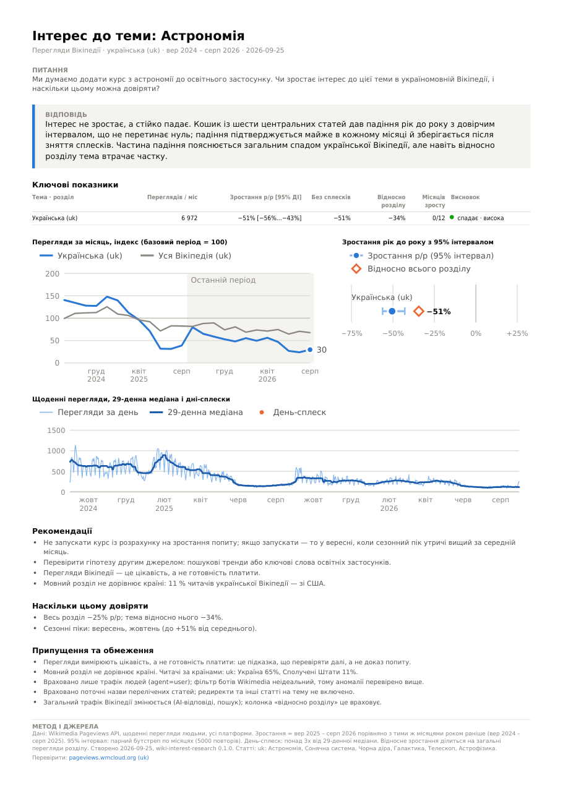
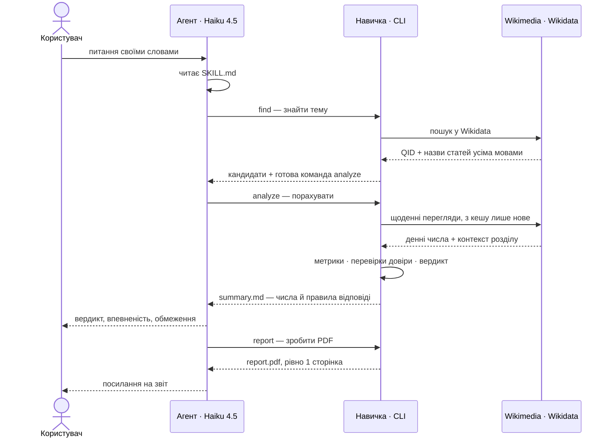

# wiki-interest-research: навичка AI-агента для дослідження інтересу до тем за переглядами Вікіпедії

Навичка у форматі [Agent Skills](https://agentskills.io) допомагає засновникам B2C-продуктів вирішувати,
**які теми розвивати і якими мовами запускатися**. Агент знаходить потрібні статті в різних мовних
розділах Вікіпедії, завантажує статистику переглядів Wikimedia, оцінює, чи зростає інтерес і
**наскільки цьому можна довіряти**, будує графіки та PDF-звіт на одну сторінку.

Ключовий принцип: **усі числа рахує код, агент лише обирає статті, запускає команди й пояснює
результат.** Дешеві моделі помиляються в арифметиці й вигадують числа; коли рахує код, цього класу
помилок немає. Тому навичкою впевнено користується навіть Claude Haiku 4.5 (перевірено, див. [розділ 7](#7-перевірка)).

```
Користувач: «Чи зростає інтерес до астрономії в україномовній Вікіпедії і наскільки цьому можна довіряти?»
Агент:  find → related → analyze → report
Відповідь: «Ні, падає: −51% р/р за 6 ключовими статтями (95% інтервал −56%…−43%), спад в усіх 12 місяцях;
            уся укрВікі втратила 25%, але й відносно неї тема −34%. Впевненість висока.» + report.pdf
```

<p align="center">
  <a href="examples/02-astronomy-uk.pdf"></a>
</p>

## Зміст

1. [Що вміє навичка](#1-що-вміє-навичка)
2. [Швидкий старт](#2-швидкий-старт)
3. [Як це працює](#3-як-це-працює)
4. [Як навичка допомагає оцінювати й перевіряти висновки](#4-як-навичка-допомагає-агенту-оцінювати-й-перевіряти-висновки)
5. [Повторні запити й робота на дешевій моделі](#5-повторні-запити-й-робота-на-дешевій-моделі)
6. [Результати на прикладах із завдання](#6-результати-на-прикладах-із-завдання)
7. [Перевірка](#7-перевірка) — тести, агентні прогони на Haiku 4.5, як перевірявся код від AI
8. [Припущення та обмеження](#8-припущення-та-обмеження)
9. [Як розвивати навичку далі](#9-як-розвивати-навичку-далі)
10. [Структура репозиторію](#10-структура-репозиторію)

## 1. Що вміє навичка

- **Знаходить статті будь-якою мовою через Wikidata**: одне поняття (наприклад, Q1666254 «інтервальне
  голодування») → назви статей у кожному мовному розділі. Якщо статті немає, прямо про це повідомляє
  (це теж інсайт: прогалина в контенті), а не підміняє мовчки схожою.
- **Будує «кошик» статей для широких тем** (астрономія = астрономія + Сонячна система + чорна діра + …),
  пропонуючи схожі статті з їхньою популярністю.
- **Рахує зростання рік до року з 95% довірчим інтервалом** за переглядами людей (без ботів) і перевіряє
  його надійність: сплески, ознаки ботів, падіння трафіку всієї Вікіпедії, малий обсяг, нові чи
  перейменовані статті, сезонність.
- **Ставить вердикт і рівень впевненості** за прозорими правилами з поясненням причин.
- **Порівнює й ранжує мови/теми** за формулою з вагами, які користувач може змінити під свої критерії.
- **Графіки** (SVG) і **PDF на одну сторінку** українською чи англійською: висновок агента, таблиця,
  перевірки довіри, обмеження й посилання для незалежної перевірки чисел.

## 2. Швидкий старт

Потрібен Node.js ≥ 20.10.

```bash
git clone https://github.com/oleg191006/wiki-interest-research.git
cd wiki-interest-research
npm ci                                     # точні версії з package-lock.json
node scripts/wiki.mjs doctor               # перевірка залежностей, мережі та кешу

node scripts/wiki.mjs find "intermittent fasting" --langs pl,cs
node scripts/wiki.mjs related Q333 --langs uk
node scripts/wiki.mjs analyze --topic "Астрономія=Q333,Q544,Q589,Q318,Q4213,Q37547" --langs uk --ui-lang uk
node scripts/wiki.mjs report --run "wiki-interest-output/астрономія_uk_24m" --lang uk \
     --question "Чи зростає інтерес до астрономії?" --answer "..." --rec "..."
```

**Встановлення для агента.** Скопіюйте папку в каталог навичок агента, наприклад
`~/.claude/skills/wiki-interest-research` для Claude Code, і виконайте в ній `npm ci`. Агент бачить
лише назву й опис навички, а SKILL.md читає, коли запит підходить.

**User-Agent.** З 2026 року Wikimedia дає клієнтам без контактних даних у User-Agent лише ~10 запитів
на хвилину (з контактами — 200). Вкажіть URL репозиторію чи email: `WIKI_SKILL_CONTACT=https://github.com/...`
(або змініть `DEFAULT_CONTACT` у `src/settings.ts`).

## 3. Як це працює



`analyze` записує в папку результату `summary.md` (коротко для агента), `analysis.json`, CSV з
денними й місячними рядами та три SVG-графіки; `report` збирає з них PDF.

### Ключові рішення і чому саме так

| Рішення                                                      | Чому                                                                                                                                                        |
| ------------------------------------------------------------ | ----------------------------------------------------------------------------------------------------------------------------------------------------------- |
| Зіставлення мов через Wikidata, а не переклад назв           | Назви статей не перекладаються дослівно («Інтервальне голодування» ≠ «Post przerywany»); Wikidata дає точну відповідність і чесно показує, де статті немає. |
| Порівняння «ті самі місяці рік тому»                         | Сезонність (навчальний рік, січневі «нові звички») взаємно гаситься без складних моделей.                                                                   |
| 95% інтервал — парний бутстреп по місяцях                    | Пояснюється одним реченням і не потребує припущень про розподіл. Широкий, якщо зростання дали 1–2 місяці; вузький, якщо воно стабільне.                     |
| Нормалізація на весь мовний розділ                           | Трафік Вікіпедії змінюється сам по собі: у реальних даних укрВікі −25% р/р, іспанська −21%. Без цього будь-яка тема виглядала б «спадною».                  |
| Детектор сплесків: > 3× від 29-денної медіани                | Відділяє разові новинні хвилі від тренду; «без сплесків» показує, скільки зростання лишається.                                                              |
| Прозорі правила впевненості (бали) замість «чорної скриньки» | Кожне зниження впевненості має названу причину, яку агент переказує користувачу.                                                                            |
| Ранжування за песимістичним краєм інтервалу                  | Ненадійне зростання не може «виграти» випадково; ваги задає користувач.                                                                                     |
| Власні SVG-графіки + PDFKit, запити через bottleneck         | Жодних нативних залежностей (canvas, headless-браузер) — однаково працює на Windows/macOS/Linux. Бібліотеки лише там, де вони несуть чужу складність.       |
| TypeScript через tsx, `package-lock.json`                    | Відтворюване середовище одним `npm ci`, без скомпільованих файлів у репозиторії.                                                                            |

Формули, пороги та обґрунтування: [references/methodology.md](references/methodology.md).

## 4. Як навичка допомагає агенту оцінювати й перевіряти висновки

1. **Вердикт за правилами.** `rising`/`falling` лише коли 95% інтервал не містить нуля і зміна ≥ 5%;
   `stable`, якщо інтервал у межах ±10%; інакше `unclear` — «даних недостатньо для висновку».
2. **Впевненість з причинами.** Стартує з 3 балів («висока»), кожна спрацьована перевірка віднімає 1–2:
   малий обсяг, зростання зі сплесків, суперечливі місяці, трафік, схожий на ботів, нова/перейменована
   стаття, тренд, що лише повторює всю Вікіпедію. Причини друкуються в розділі _Checks_ і потрапляють у PDF.
3. **«Key findings (safe to quote)»** — готові речення з числами, які агент цитує без перерахунку.
4. **Незалежна перевірка.** Для кожної мови друкується посилання на pageviews.wmcloud.org з тими ж
   статтями й періодом, щоб людина могла звірити сирі числа.
5. **Правила відповіді в SKILL.md**: цитувати числа дослівно, не вигадувати причин сплесків, завжди
   називати обмеження (цікавість ≠ готовність платити; мова ≠ країна) і пропонувати крок валідації.

**Пастки в реальних даних, які навичка ловить** (усі знайдені під час розробки, для кожної є тест):

- у польській Вікіпедії **немає статті** про інтервальне голодування → «виміряти неможливо», а не «нуль інтересу»;
- Wikimedia **приховує країни** зі свого списку захисту: у турецькій Вікіпедії «немає» Туреччини,
  у в'єтнамській — В'єтнаму. Наївний висновок «47% читачів в'єтнамської Вікіпедії — зі США» був би хибним;
  навичка позначає такі дані як `INCOMPLETE`;
- **падіння всієї платформи** (укрВікі −25% р/р) → колонка «відносно розділу»;
- **шкільна сезонність** (провал у червні, пік у вересні) → порівняння тих самих місяців;
- **редиректи**: у португальській Вікіпедії 19% переглядів IELTS ідуть через редирект «IELTS»;
- **перейменування й нові статті**: різкий старт переглядів з нуля знижує впевненість.

## 5. Повторні запити й робота на дешевій моделі

- **Інкрементальний кеш за логічним ключем** (мова + стаття + тип доступу), а не за URL: якщо спершу
  запитали 2 роки, а потім 3 — докачується лише бракуючий рік. Приклад (6 мов, 12 статей): перший
  запуск ≈ 26 с (≈ 75 запитів), повтор чи зміна ваг — **0,2 с, 0 запитів**.
- **Уточнення = той самий `analyze` зі зміненими параметрами** («додай словацьку», «3 роки», «вага
  зростання вища»): папка результату визначається темою, мовами й періодом.
- **Ліміти Wikimedia**: ≤ 3 паралельні запити, ≤ 150 запитів/хв, повтор з урахуванням `Retry-After` на 429/503.
- **4 команди** з розумними значеннями за замовчуванням; кожна друкує **наступну команду**.
- **`summary.md` на 40–80 рядків** замість сирих даних, з блоком «How to answer» наприкінці — правила
  нагадуються саме тоді, коли модель формулює відповідь.
- **Помилки з підказками**: `"ua" looks like a country code… Did you mean "uk"?`; запит на понад 10 серій
  відхиляється з порадою розбити питання.
- **SKILL.md ≈ 140 рядків**, деталі в `references/` — модель читає їх лише за потреби.
- **PDF завжди рівно на одну сторінку**: код сам масштабує текст і прибирає другорядні блоки.

## 6. Результати на прикладах із завдання

Реальні дані Wikimedia, зростання = вер 2025–серп 2026 проти вер 2024–серп 2025.
PDF-звіти та `summary.md`, які бачив агент, лежать у [`examples/`](examples/).

| Запит                                       | Що показала навичка                                                                                                                                                                                                                                                                                                                                                                                                      |
| ------------------------------------------- | ------------------------------------------------------------------------------------------------------------------------------------------------------------------------------------------------------------------------------------------------------------------------------------------------------------------------------------------------------------------------------------------------------------------------ |
| Інтервальне голодування: польська vs чеська | У **польській Вікіпедії статті немає** (Q1666254 не має plwiki) → порівняння неможливе без замінника. Чеська: −54% р/р [−69%…−33%], 0/12 місяців зростання, але лише ~5 переглядів на день → **низька впевненість**.                                                                                                                                                                                                     |
| Астрономія в україномовній Вікіпедії        | Кошик із 6 статей: **−51% р/р** [−56%…−43%], спад в усіх 12 місяцях; уся укрВікі −25%, відносно неї тема −34% → **падає, висока впевненість**. Сезонний пік — вересень–жовтень (навчальний рік).                                                                                                                                                                                                                         |
| Вивчення англійської у 6 розділах           | **Припущення:** інтерес до вивчення англійської виміряно через статті про іспити IELTS і TOEFL (користувач може замінити кошик). Падіння в 5 із 6 розділів (від −34% у польській до −62% у португальській); **турецька — «неясно»** (−11%, інтервал містить нуль; відносно розділу +6%). Рейтинг: в'єтнамська і турецька — найбільший обсяг і найменше відносне падіння; для них позначено, що дані за країнами неповні. |

## 7. Перевірка

**Автотести** (`npm test`, 32 тести, вбудований `node:test`, ~3 с; плюс `npm run typecheck`):

- **синтетичні ряди з відомою відповіддю** (10 сценаріїв): рівне +20% → `rising`, висока впевненість;
  чиста сезонність → `stable`; «зростання» з кількох днів-сплесків → не надійне; падіння платформи
  відокремлюється від теми; стрибок частки десктопу → підозра на ботів; 6 переглядів на день → низька впевненість;
- **наскрізний офлайн-прогін** на записаних реальних відповідях API: CLI → аналіз → PDF, з перевіркою
  відомих чисел і того, що звіт із дуже довгими текстами все одно займає 1 сторінку;
- сценарій аналізу на підроблених джерелах, статистика (квантилі, знаковий тест, бутстреп), розбір
  аргументів і кодів мов, а також тест самого оцінювача (ловить вигаданий відсоток у відповіді).

**Мутаційна перевірка тестів** — код навмисно ламався, щоб переконатися, що тести справді щось стережуть:

| Що зламано                                                | Який тест упав                                           |
| --------------------------------------------------------- | -------------------------------------------------------- |
| детектор сплесків вимкнено (`SPIKE_MULTIPLE` 3 → 1000)    | «зростання з кількох сплеск-днів не визнається надійним» |
| перевірка сталості місяців вимкнена (⅔ → 0)               | «зростання меншістю місяців позначається як нерівне»     |
| детектор ботів вимкнено (`BOT_DESKTOP_SHIFT` 0,15 → 0,95) | «сплеск лише з десктопу позначається як можливий бот»    |
| нормалізація: ділення замінено відніманням                | «падіння платформи відокремлюється від інтересу до теми» |
| поріг суттєвої зміни 5% → 50%                             | усі 4 тести про вердикти                                 |

**Агентні тести на Haiku 4.5** ([`evals/`](evals/)): 6 сценаріїв — 3 приклади із завдання, помилкові
коди мов UA/CZ, уточнення з повторним запуском і «майже схожий» запит, на який навичка НЕ має
спрацьовувати. Вони запускаються в справжньому Claude Code й оцінюються **кодом, а не іншою моделлю**:
чи агент використав навичку, чи не писав власний код, чи створив PDF, чи назвав впевненість і — головне —
**чи всі відсотки у відповіді справді є у виводі інструмента**.

| Ітерація | Пройдено  | Що змінилось після аналізу транскриптів                                                                                                     |
| -------- | --------- | ------------------------------------------------------------------------------------------------------------------------------------------- |
| 1        | 27/29     | вигадане «±15–20%», не названо впевненість, пізнє спрацювання навички → опис став наполегливішим, вимога цитувати лише числа з `summary.md` |
| 2        | 26/29     | збій середовища: модель почала міняти оболонки й шляхи → правило «повтори ту саму команду тим самим шляхом»                                 |
| 3        | **30/30** | навичка вмикається з першого виклику; викликів на сценарій стало 3–5 замість 4–10 (у 3-й ітерації додано near-miss сценарій, звідси 30)     |

Ітерації прогнано на першій версії коду. Після переписування SKILL.md не змінився, а той самий аналіз
дав побайтово однакові графіки, CSV і PDF в обох версіях; контрольний прогін нового коду на Haiku — 5/5.
Повний журнал: [`evals/results.md`](evals/results.md).

```bash
node --import tsx evals/run-claude.ts --model claude-haiku-4-5-20251001               # Claude Code, Haiku 4.5
OPENROUTER_API_KEY=... node --import tsx evals/run-openrouter.ts --model <модель>:free  # інша модель (результатів у журналі немає)
```

### Як перевірявся код, написаний з AI

Навичку розроблено з Claude Code (архітектура, код, тести, документація). Крім тестів вище:

- **Незалежний перерахунок**: ключові числа перераховано іншим шляхом (інший ендпоінт API, інша мова
  програмування) — збіг до одиниці; живий прогін з порожнім кешем дав ті самі числа, що й записані фікстури.
- **Ручний перегляд кожного PDF і графіка**. Так знайдено й виправлено: накладання підписів осі, неправильний
  масштаб SVG у PDF, переповнення звіту на 2 сторінки при 6 мовах, англійські підписи в українському звіті,
  граматику числівників.
- **Реальні дані замість ідеального сценарію**: пастки з [розділу 4](#4-як-навичка-допомагає-агенту-оцінювати-й-перевіряти-висновки)
  не були в початковому плані — їх знайдено на живих даних, і кожну закрито тестом.

## 8. Припущення та обмеження

- **Перегляди ≠ готовність платити.** Це сигнал, що варто перевірити, а не доказ попиту.
- **Мовний розділ ≠ країна.** Іспанську читають в Іспанії, Мексиці, Аргентині; частина носіїв читає
  англійську Вікіпедію. Дані за країнами приватно-захищені й неповні для деяких країн.
- **Тема = вибраний кошик статей.** Висновок стосується саме цих статей (вони перелічені у звіті); інший
  кошик може дати інший результат.
- **Фільтр ботів Wikimedia неідеальний**; навичка додатково шукає аномалії, але не гарантує чистоту.
- **Рахуються поточні назви статей**; редиректи й інші статті на тему не входять (частка редиректів показується).
- **Малі розділи й нішеві теми** дають кілька переглядів на день — висновки там слабкі (навичка це позначає).
- **Зміни платформи** (AI-відповіді в пошуку, перекласифікація ботів) нормалізація враховує лише частково.
- **Масштаб**: одне дослідження — до 10 серій (теми × мови); для масштабних досліджень потрібні дампи (див. нижче).

## 9. Як розвивати навичку далі

**Ітерація 1 — точність і зручність**

- Детектор «сходинок» (changepoint): різкі зміни рівня від змін у Google, перейменувань, методики ботів.
- Історичні ряди з урахуванням редиректів (сума переглядів статті та її редиректів).
- Пошук тем, що ростуть: «що набирає популярності в польській Вікіпедії в категорії освіта» через top-articles API.

**Ітерація 2 — складніші дослідження**

- Автоматичні кошики тем через Wikidata SPARQL (усі підкласи/частини поняття) і категорії Вікіпедії.
- Тріангуляція з іншими сигналами: пошукові тренди, ключові слова в магазинах застосунків → спільний індекс впевненості.
- Clickstream-дампи Wikimedia: звідки читачі приходять на статтю (пошук vs внутрішні посилання) як міра наміру.
- «Пам'ять дослідження»: збереження гіпотез і припущень проєкту, щоб наступні запити на них посилалися.

**Ітерація 3 — великі обсяги даних**

- Перехід з поштучних REST-запитів на дампи `pageview_complete` (усі статті × усі мови, щоденно) →
  Parquet + DuckDB з інкрементальним оновленням; скринінг тисяч тем × ~300 мовних розділів за хвилини.
- Попередньо обчислена матриця «тема × мова», кластеризація статей у теми (ембединги).
- Навичка як MCP-сервер/API для кількох агентів, планове оновлення, моніторинг якості даних.

**Процес для кожної ітерації**: поповнювати `evals/evals.json` реальними запитами користувачів і
«майже схожими» запитами, ганяти їх на дешевих моделях у CI (частка пройдених перевірок, кількість
викликів, вартість), а кожну нову пастку в даних закривати тестом на синтетичних даних з відомою відповіддю.

## 10. Структура репозиторію

Залежності в коді йдуть лише всередину: `cli` → `application` (сценарії) → `domain` (чиста логіка без
мережі й файлів); `infrastructure` і `presentation` реалізують інтерфейси з `application/ports.ts`.

```
wiki-interest-research/            ← папка навички (усе потрібне всередині)
├── SKILL.md                       інструкції для агента
├── scripts/wiki.mjs               точка входу (запускає TypeScript через tsx)
├── src/
│   ├── domain/                    метрики тренду, перевірки довіри, ранжування, мови, статистика
│   ├── application/               сценарії analyze, find, related, report + ports.ts
│   ├── infrastructure/            Wikimedia/Wikidata/MediaWiki, HTTP, кеш, сховище
│   ├── presentation/              SVG-графіки, PDF, summary.md, i18n (uk/en), CSV
│   └── cli/                       команди й розбір аргументів
├── references/                    methodology.md, interpretation.md, commands.md (для агента)
├── tests/                         unit + e2e тести, записані відповіді API
├── evals/                         агентні сценарії, оцінювач, раннери, results.md
└── examples/                      PDF-звіти й summary.md для трьох запитів із завдання
```

Ліцензія: MIT. Дані: Wikimedia Foundation (CC0 для статистики переглядів).
